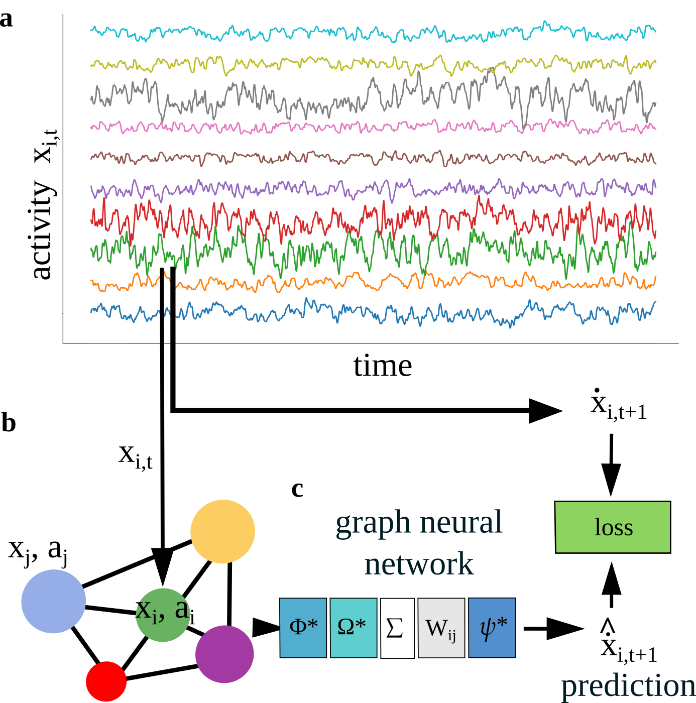

# NeuralGraph

Graph network modeling neural activities

<p align="center">
  
</p>
<p align="center">The temporal activity of a simulated neural network (a) is converted into densely connected graph (b) processed by a message passing GNN (c). Each neuron (node i) receives activity signals from connected neurons (node j), processed by a transfer function and weighted by the connection matrix. The sum of these messages is updated to obtain the predicted activity rate. In addition to the observed activity, the GNN has access to learnable latent a_i vectors associated with each node.</p>

### Setup

Create a conda environment based on your system architecture:

- MacOS:

```
conda env create -f envs/environment.mac.yaml
conda activate neural-graph-mac
```

- Linux: we are currently using the cuda 13 wheels, which requires that your
  system nvidia drivers are version >= 565.xx. Update the `--extra-index-url`
  to use the cuda 12.x wheels, e.g.,

```
--- a/envs/environment.linux.yaml
+++ b/envs/environment.linux.yaml
@@ -41,8 +41,8 @@ dependencies:
   - jupytext

   - pip:
-      # Get CUDA 13.0 wheels
-      - --extra-index-url https://download.pytorch.org/whl/cu130
+      # Get CUDA 12.9 wheels
+      - --extra-index-url https://download.pytorch.org/whl/cu129
       - torch==2.9
       - torchvision==0.24
       - torchaudio==2.9
```

and then

```
conda env create -f envs/environment.linux.yaml
conda activate neural-graph-linux
```

Install tiny-cuda-nn manually

```
pip install git+https://github.com/NVlabs/tiny-cuda-nn/#subdirectory=bindings/torch
```

Install the package by executing the following command from the root of this directory:

```
pip install -e .
```

```python
from NeuralGraph import *
```

The entry point for the code is to run `python GNN_Main.py`
See [PR #13](https://github.com/saalfeldlab/NeuralGraph/pull/13) for one way to add
support for running the code on multiple machines.

### Demo Scripts

Demo scripts reproduce key figures from the paper:
_"Graph neural networks uncover structure and function underlying the activity of neural assemblies"_

#### Demo 1 - Figure 2: Baseline (1000 neurons, 4 types)

Reproduces Figure 2: 1000 densely connected neurons with 4 neuron-dependent update functions.

```bash
python demo_1.py    # run full pipeline (generate, train, test, plot)
```

**Simulation parameters** (from Table 1 in the paper):

- N_neurons: 1000
- N_types: 4 (tau_i = {0.5, 1}, s_i = {1, 2})
- N_frames: 100,000
- Connectivity: 100% (dense)
- Noise: none
- External inputs: none

**Output folders:**

- Generated data: `./graphs_data/signal/signal_demo_1/`
- Training models: `./log/signal/signal_demo_1/models/`
- Results: `./log/signal/signal_demo_1/results/`
- **Figure 2 panels: `./log/signal/signal_demo_1/results/Fig2/`**

**Generated figures** (in `Fig2/` folder):

- `Fig2a_activity_time_series.png` - Activity time series
- `Fig2c_connectivity_true.png` - True connectivity matrix W_ij
- `Fig2d_connectivity_learned.png` - Learned connectivity matrix
- `Fig2e_weights_comparison.png` - Comparison of learned vs true connectivity (R², slope)
- `Fig2f_embedding.pdf` - Learned latent vectors a_i (2D embedding showing 4 clusters)
- `Fig2g_phi_update_functions.png` - Learned update functions phi\*(a_i, x)
- `Fig2h_psi_transfer_function.png` - Learned transfer function psi\*(x)

#### Demo 2 - Figure 3: External inputs (2048 neurons, 4 types)

Reproduces Figure 3: 2048 densely connected neurons with external inputs Omega_i(t).

```bash
python demo_2.py    # run full pipeline (generate, train, test, plot)
```

**Simulation parameters** (from Table 1 in the paper):

- N_neurons: 2048 (1024 with external inputs + 1024 without)
- N_types: 4 (tau_i = {0.5, 1}, s_i = {1, 2}, gamma_j = {1, 2, 4, 8})
- N_frames: 50,000 (reduced from 100,000 in the paper for faster demo)
- Connectivity: 100% (dense)
- Noise: yes (sigma^2 = 1)
- External inputs: yes - time-dependent scalar field Omega_i(t)

**Output folders:**

- Generated data: `./graphs_data/signal/signal_demo_2/`
- Training models: `./log/signal/signal_demo_2/models/`
- Results: `./log/signal/signal_demo_2/results/`
- **Figure 3 panels: `./log/signal/signal_demo_2/results/Fig3/`**

**Generated figures** (in `Fig3/` folder):

- `Fig3a_external_input_omega.png` - External inputs Omega_i(t) field
- `Fig3b_activity_time_series.png` - Activity time series
- `Fig3d_weights_comparison.png` - Comparison of learned vs true connectivity W_ij
- `Fig3e_omega_comparison.png` - Comparison of learned vs true Omega_i(t) values
- `Fig3f_omega_field_true.png` - True field Omega_i(t) at different time-points
- `Fig3g_omega_field_learned.png` - Learned field Omega\*(t) at different time-points
